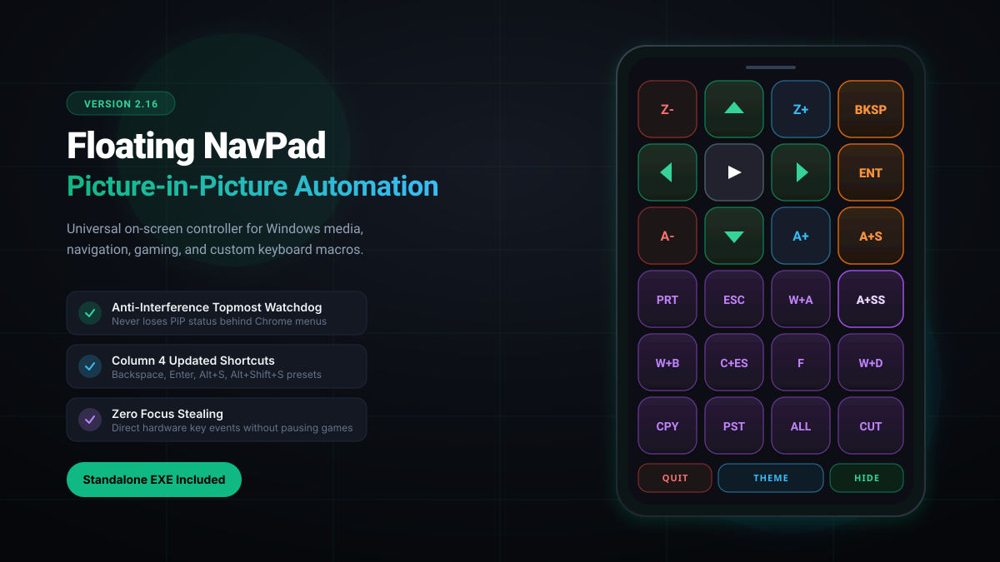

# Floating NavPad v2.16 🎮⚡

[](https://github.com/)
[](https://github.com/)
[](https://www.python.org/)
[](LICENSE)

> A lightweight, always-on-top, picture-in-picture automation and navigation overlay for Windows. Control media, volume, navigation arrows, system utilities, and custom macro hotkeys without stealing focus from your full-screen games, video players, or code editors.

---

## 📸 Screenshots

### 1. Expanded Obsidian Controller (Full 4×6 Grid)


### 2. Minimized Assistive Touch Floating Pill


---

## 🚀 Quick Download & Run

### Option A: Download the Pre-Compiled Windows EXE (Recommended)
You can download the standalone **`.exe`** file directly — **no Python installation or setup required**:

1. Go to the **[Releases](https://github.com/)** page of this repository.
2. Under the latest **v2.16 Release**, click on **`NavPad-v2.16.exe`** to download.
3. Double-click **`NavPad-v2.16.exe`** to launch!
   *(Settings and theme preferences will automatically save to `navpad_config.json` next to the EXE).*

---

### Option B: Run Directly via Python Source Code

1. **Clone the repository**:
   ```bash
   git clone https://github.com/<your-username>/floating-navpad.git
   cd floating-navpad
   ```

2. **Install dependencies**:
   ```bash
   pip install -r requirements.txt
   ```

3. **Run the script**:
   ```bash
   python navpad.py
   ```

---

### Option C: Build the Standalone EXE Yourself

#### Method 1: Double-Click Batch File (Easiest on Windows)
Simply double-click **`build_exe.bat`** in the repository root. It will automatically check Python, install requirements, and output `dist\NavPad-v2.16.exe`.

#### Method 2: PowerShell / Terminal Command
```powershell
python -m pip install --upgrade pyinstaller pyautogui
python -m PyInstaller --onefile --noconsole --name "NavPad-v2.16" navpad.py
```
Your compiled binary will be located in:
```powershell
.\dist\NavPad-v2.16.exe
```

---

## ✨ Features in Version 2.16

- **🛡️ Anti-Interference Topmost Watchdog Loop**:
  - Automatically reasserts `HWND_TOPMOST` and Win32 extended window styles every 1.5 seconds.
  - Prevents the pad from being pushed behind Chrome, Edge, or game windows when foreign right-click context menus open.
  - Mouse hover (`<Enter>`) immediately brings the pad to the front without taking window focus.
- **⚡ Non-Activating Focus Engine (`WS_EX_NOACTIVATE`)**:
  - Triggers keys using low-level Win32 keyboard events without deactivating your current active window.
- **⌨️ Updated Column 4 Default Presets**:
  - **Row 0, Col 4**: `Backspace` (Label: `BKSP`)
  - **Row 1, Col 4**: `Enter` (Label: `ENT`)
  - **Row 2, Col 4**: `Alt + S` (Label: `A+S`)
  - **Row 3, Col 4**: `Alt + Shift + S` (Label: `A+SS`)
- **🖱️ Right-Click Shortcut Customization & Reset**:
  - Right-click any customizable button to select from 24+ preset macros or assign any custom key combination (e.g. `Ctrl+Shift+Esc`).
  - Includes an instant **"↺ Reset to Default"** option in the right-click menu.
- **🎨 Live Theme Engine & Assistive Touch Bubble**:
  - Customize pad background, borders, opacity (`A-`/`A+`), and scale (`Z-`/`Z+`).
  - Toggle between the full 4x6 grid and the compact Assistive Touch floating pill.

---

## 🎛️ Default Button Layout Reference

| Column 1 | Column 2 | Column 3 | Column 4 (v2.16) |
|:---:|:---:|:---:|:---:|
| **Z-** (Zoom Out) | **▲** (Up Arrow) | **Z+** (Zoom In) | **BKSP** (Backspace) |
| **◀** (Left Arrow) | **⏵⏸** (Play / Pause) | **▶** (Right Arrow) | **ENT** (Enter) |
| **A-** (Alpha Out) | **▼** (Down Arrow) | **A+** (Alpha In) | **A+S** (Alt + S) |
| **PRT** (PrintScreen) | **ESC** (Escape) | **W+A** (Win + Alt) | **A+SS** (Alt + Shift + S) |
| **W+B** (Reset GPU) | **C+ES** (Start / Ctrl+Esc) | **F** (Fullscreen) | **W+D** (Minimize All) |
| **CPY** (Ctrl + C) | **PST** (Ctrl + V) | **ALL** (Ctrl + A) | **CUT** (Ctrl + X) |

---

## 🤖 Automated GitHub Release (GitHub Actions)

This repository includes **`.github/workflows/build-release.yml`**:
- Whenever you push a git tag (e.g., `git tag v2.16 && git push origin v2.16`), GitHub Actions automatically spins up a clean Windows machine, compiles `navpad.py` into `NavPad-v2.16.exe`, and attaches the executable to your GitHub Release page automatically!

---

## 📄 License
Released under the [MIT License](LICENSE).
